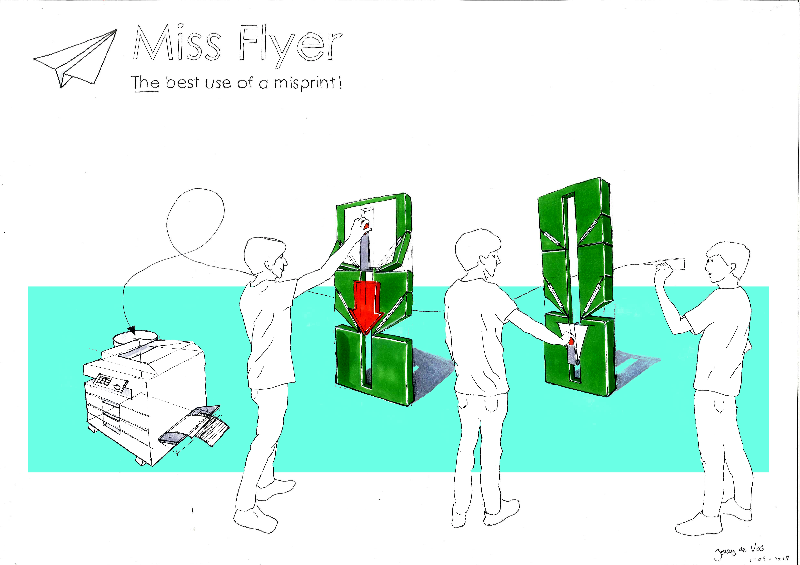
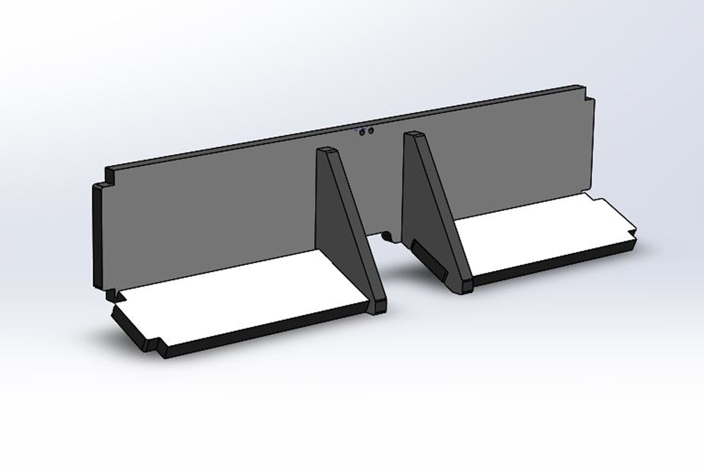
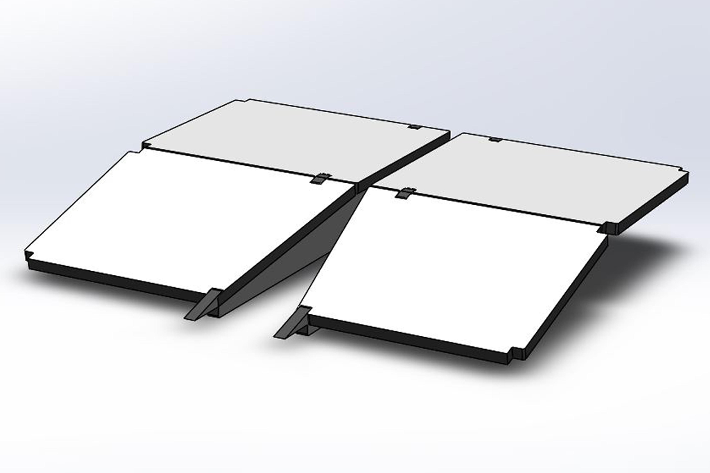
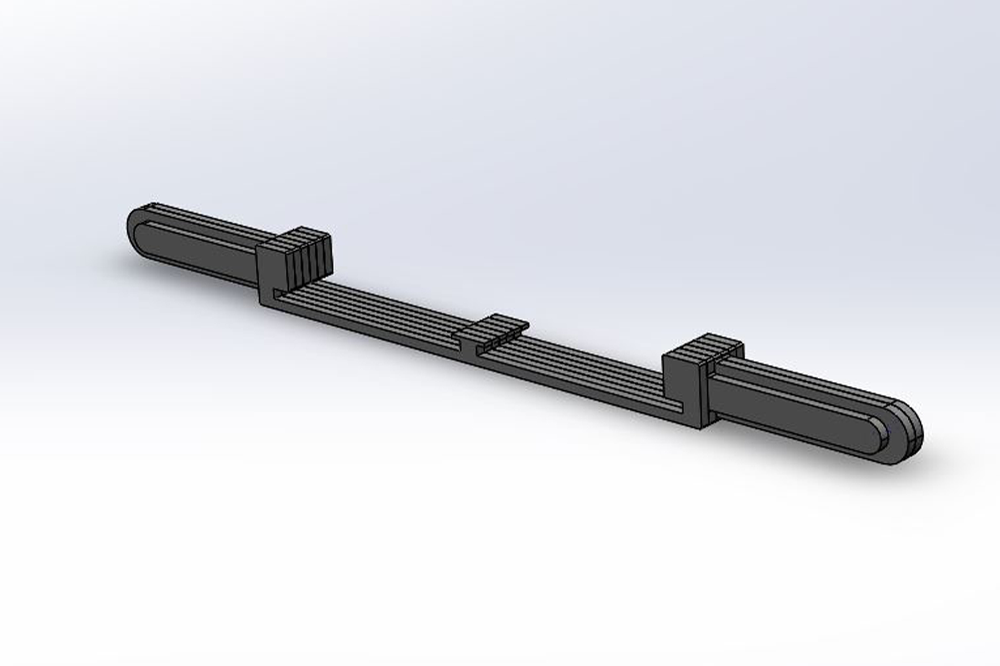
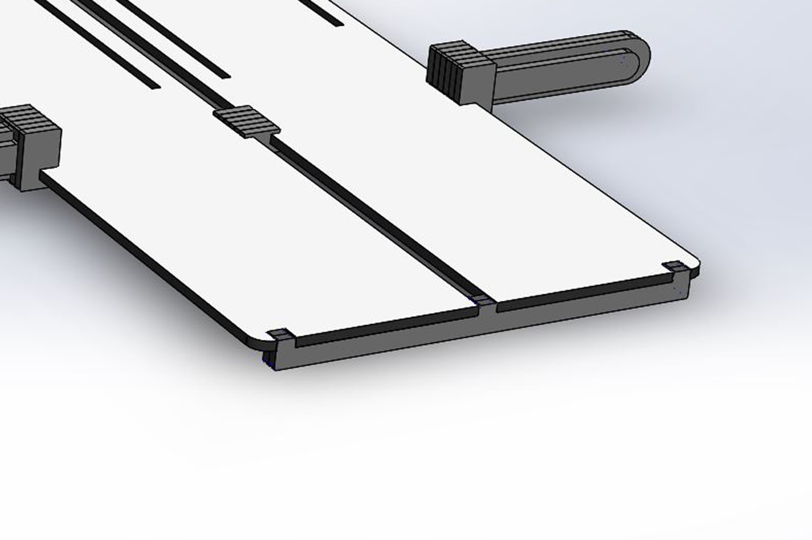
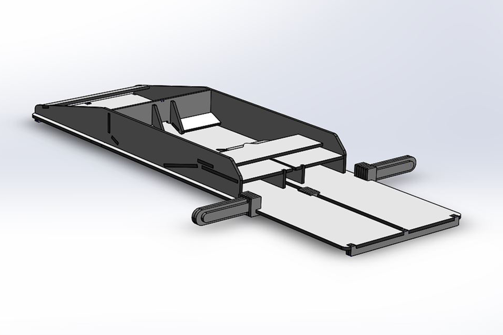
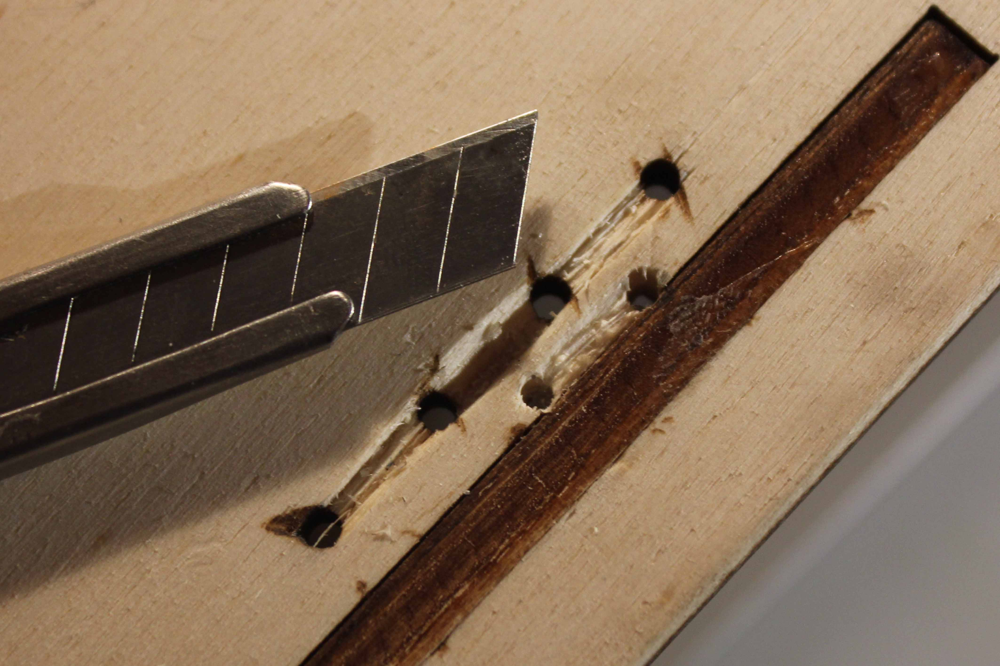
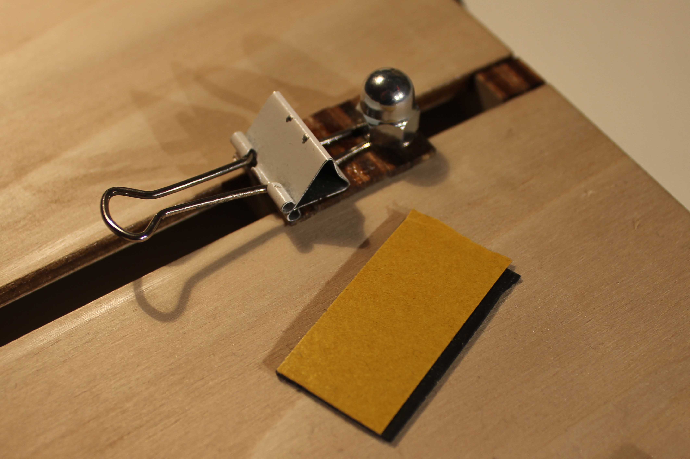
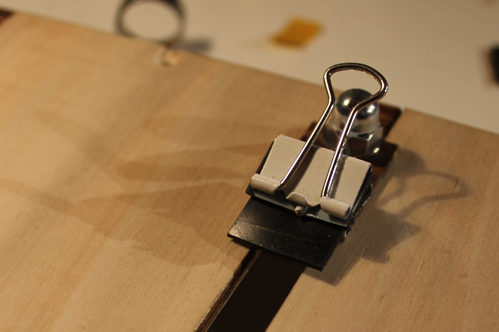

***
Miss Flyer the best use of a misprint!
It can turn an ordenairy paper into an extra ordaniary paper plane with only one swipe! :open_mouth:
Entirely made from a single sheet of lasercutted plywood.

One gif says more than 1000 words:

Miss Flyer in use:

Overview photo:

Lasercut overview:

Initial sketch:

How i made all of this? I made a A3 logbook:

***
Bill Of Material:

|Quantity|Description|Dimentions|
|--------|-----------|---------|
|1|Sheet of plywood|5mm 830x650mm|
|1|Fishing rod or other thin wire|40cm|
|1|Binder clip|20mm(smaller the better)|
|1|Rubber|20x10mm|

***
Instructions:
1. Assemble subassembly 1:

2. Assemble subassembly 2:

3. Glue slider together:

4. Insert slider and add endstops:

5. Aassemble rest:

6. Cutout wood between holes so wire can sit flush and slider can still slide:

7. Glue or bolt clip down and add a piece of rubber (in my case bike tire) to the clip for better grip:

8. like this:

***
Changelog:
 - Version 1: Genesis
 - Version 2: Improved version!
***
Future development:
 - [x] Write building Instructions
 - [x] Better performance
 - [?] No need for glue
 - [x] Engraving
 - [ ] More Paper plane designs

***

It's Open Source, enjoy!

Made for PO2 Project at the Technical university of Delft.

The paper plane folder isn't perfect, sometimes the paper creases. let me know if you have improvements :smiley:

***
Video:

