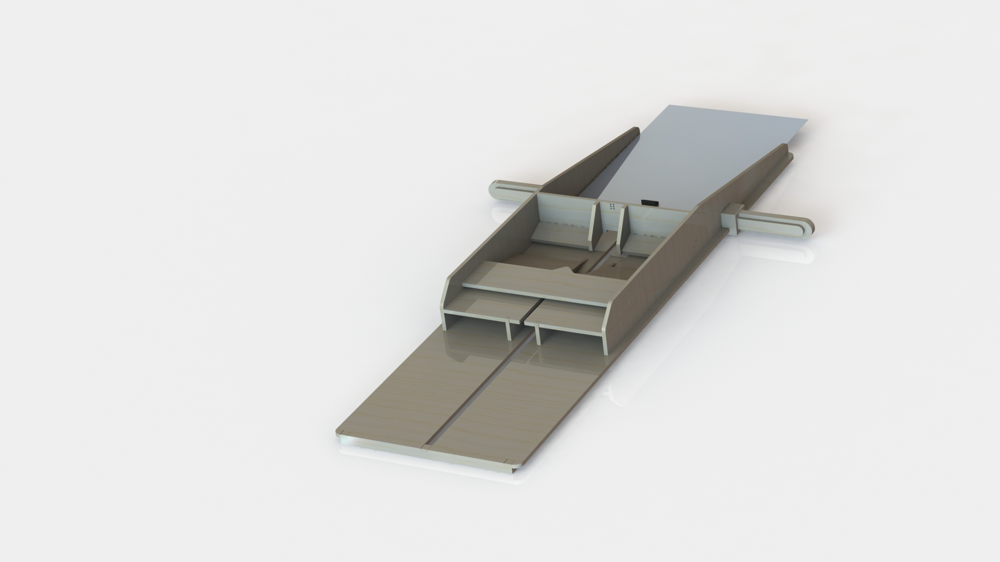

***
# Miss-Flyer

Miss flyer the best use of a misprint!
The paper plane folder can turn an ordenairy paper into an extra ordaniary paper plane with only one swipe!
Entirely made from a single sheet of lasercutted plywood.

~Picture of product in use~

Overview photo:

CAD render:

Lasercut overview:

Initial sketch:

***
Bill Of Material:

|Quantity|Description|Dimentions|
|--------|-----------|---------|
|1|Sheet of plywood|5mm 830x650mm|
|1|Fishing rod or other thin wire|40cm|
|1|Binder clip|20mm|

***
Instructions:
~To be written~

***
Changelog:
 - Version 1: genesis

***
Future development:
 - [ ] Write building Instructions
 - [ ] Better performance
 - [ ] No need for glue
 - [ ] Engraving

***

It's Open Source, enjoy!
Made for PO2 Project at the Technical university of Delft.
***
