***
Miss Flyer the best use of a misprint!
It can turn an ordenairy paper into an extra ordaniary paper plane with only one swipe! :open_mouth:

Entirely made from one single sheet of lasercutted plywood.

KRO-NCRV, Klaas vindt uit (Dutch TV) seemed to like it, so they wanted to show it to everyone :smiley: here is a to the video:
(click on image)

One gif says more than 1000 words:

Miss Flyer in use:

Overview photo:
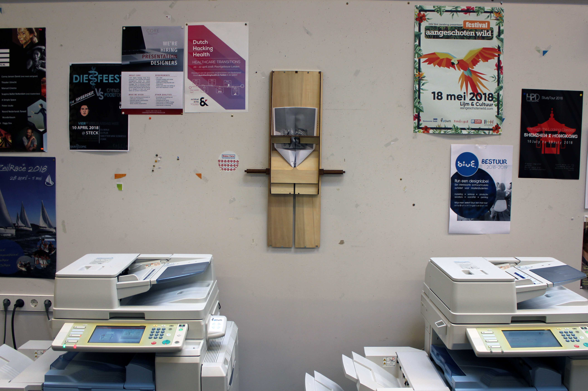

Lasercut overview:
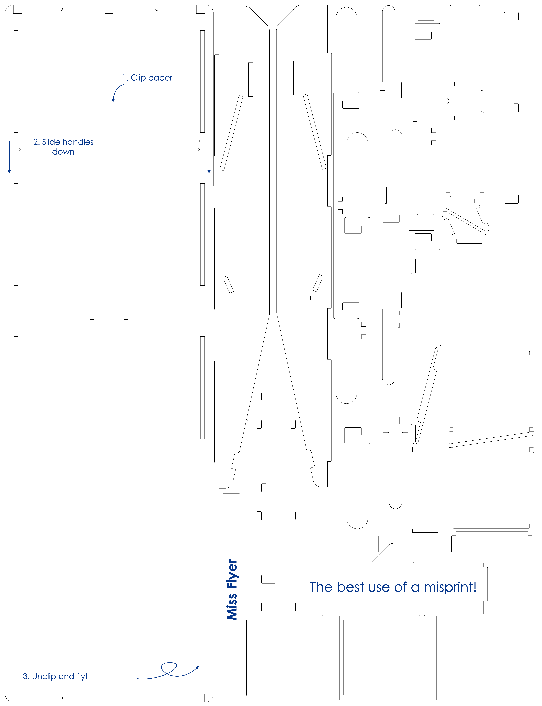

Initial sketch:
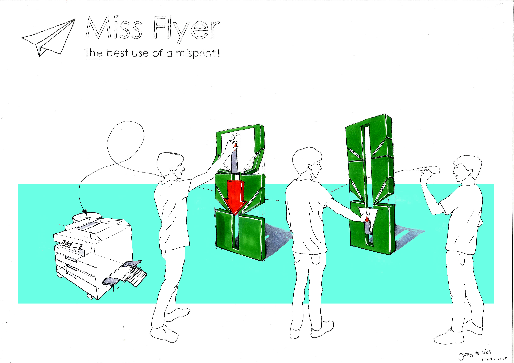

How i made all of this? I kept a A3 logbook:

***
Video:
(click on image)

***
Bill Of Material:

|Quantity|Description|Dimentions|
|--------|-----------|---------|
|1|Sheet of plywood|5mm 830x650mm|
|1|Fishing rod or other thin wire|40cm|
|1|Binder clip|20mm(smaller=better)|
|1|Rubber|20x10mm|

***

Instructions:
1. Assemble subassembly 1:
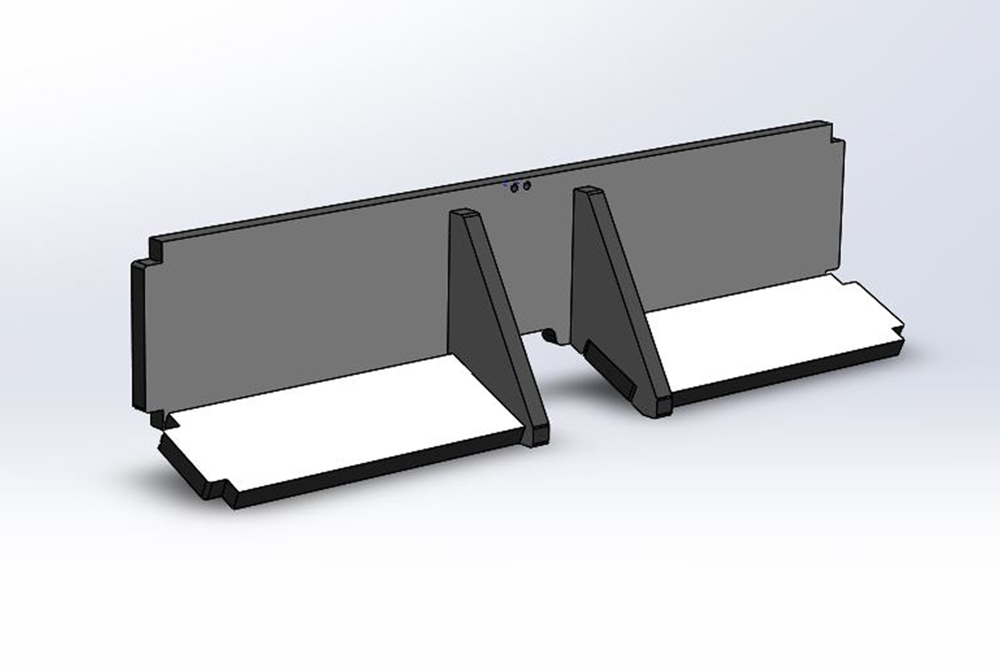

2. Assemble subassembly 2:
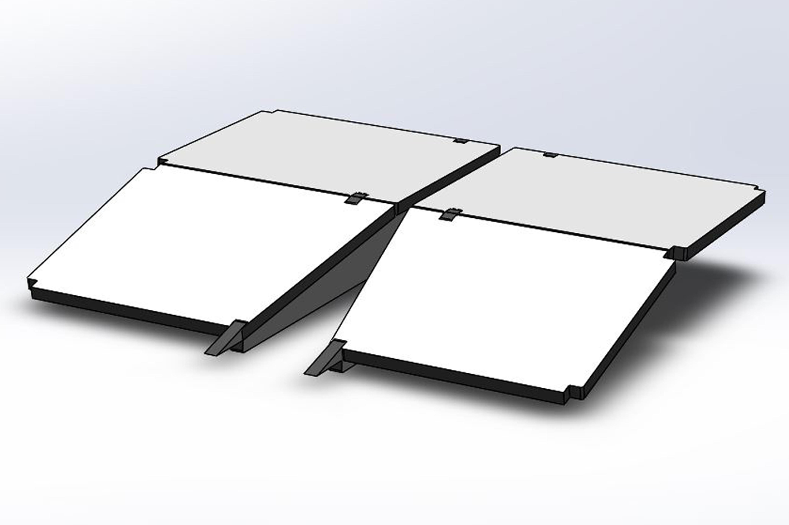

3. Glue slider together:
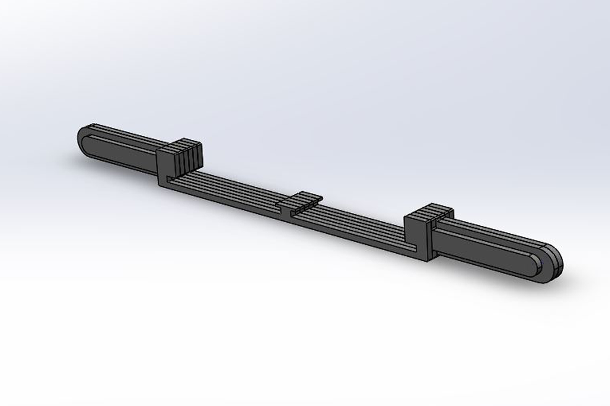

4. Insert slider and add endstops:
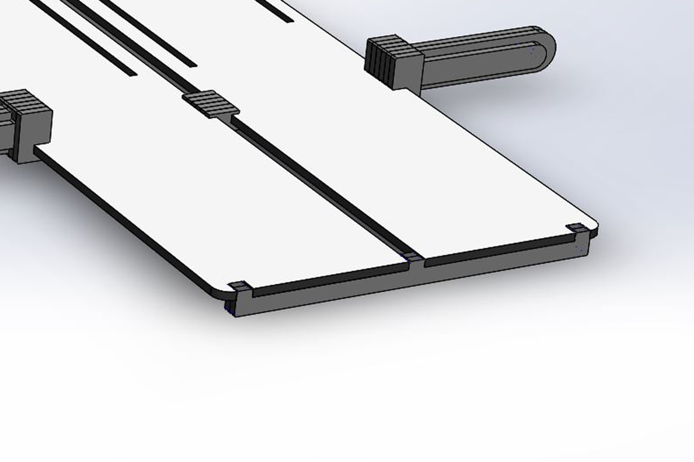

5. Assemble rest:
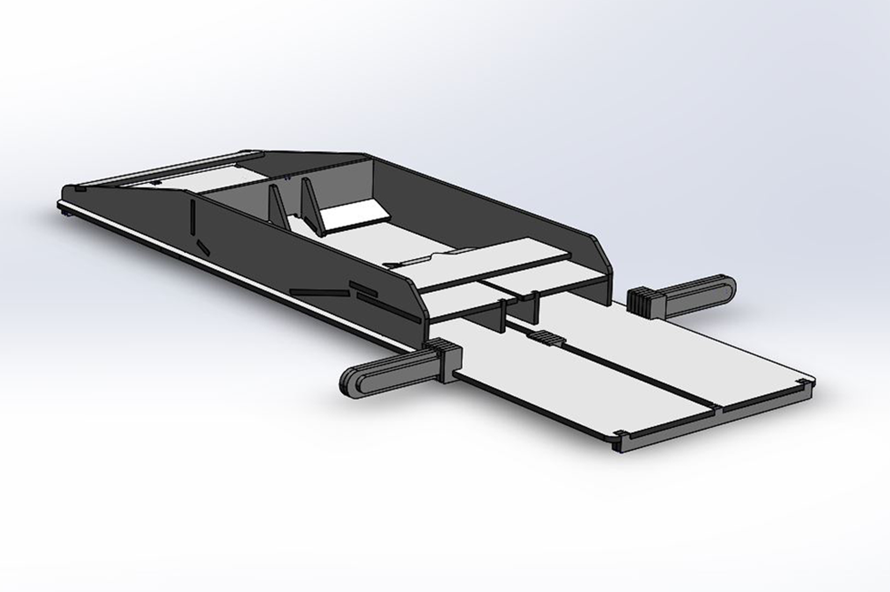

6. Cutout wood between holes so wire can sit flush and slider can still slide:
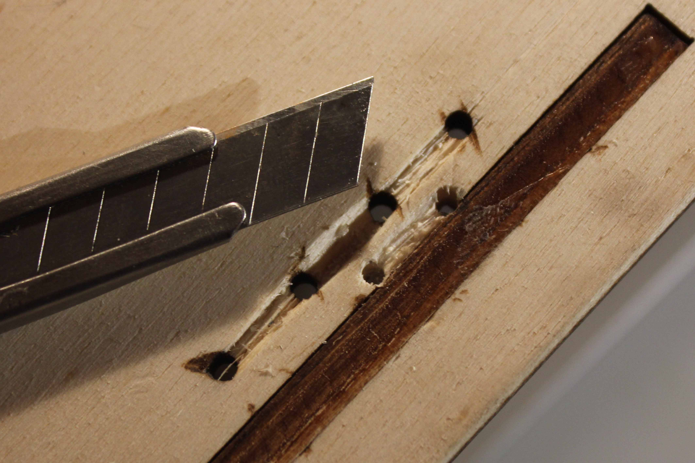

7. Glue or bolt clip down and add a piece of rubber (in my case bike tire) to the clip for better grip:
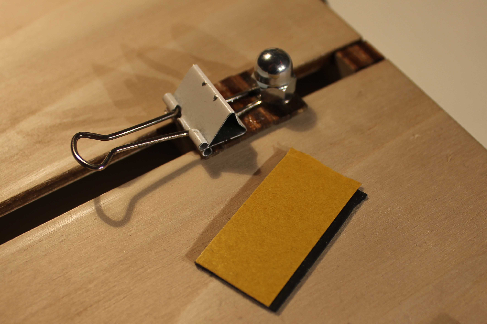

8. Like this:
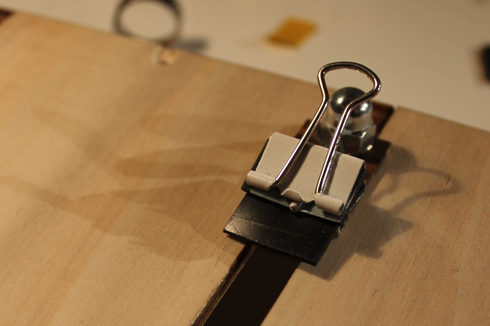

NOW HAVE FUN!!
***
Changelog:
 - Version 1: Genesis
 - Version 2: Changed xx from 5mm to 3mm, changed distance between step 1 and 2 from xx mm to xx mm
 - Version 3: Zohar & me made the second version but this raised some issues. changed xx from 3mm to 5mm again cause the paper kept ripping. changed the cutouts to 4.95mm so it's more of a friction fit.
***
Future development:
 - [x] Write building Instructions
 - [x] Better performance
 - [x] Engraving
 - [ ] No need for glue (?)
 - [ ] More paper plane designs
 - [x] Have a paper plane war at the office!

***

It's Open Source, go ahead build it!

Made for PO2 Project at the Technical university of Delft.
for questions please feel open in issue [here](https://github.com/Jerzeek/Miss-Flyer/issues) or

send me an email (info @ jerrydevos.nl)

The paper plane folder isn't perfect, sometimes the paper creases. let me know if you have improvements :smiley:

***
